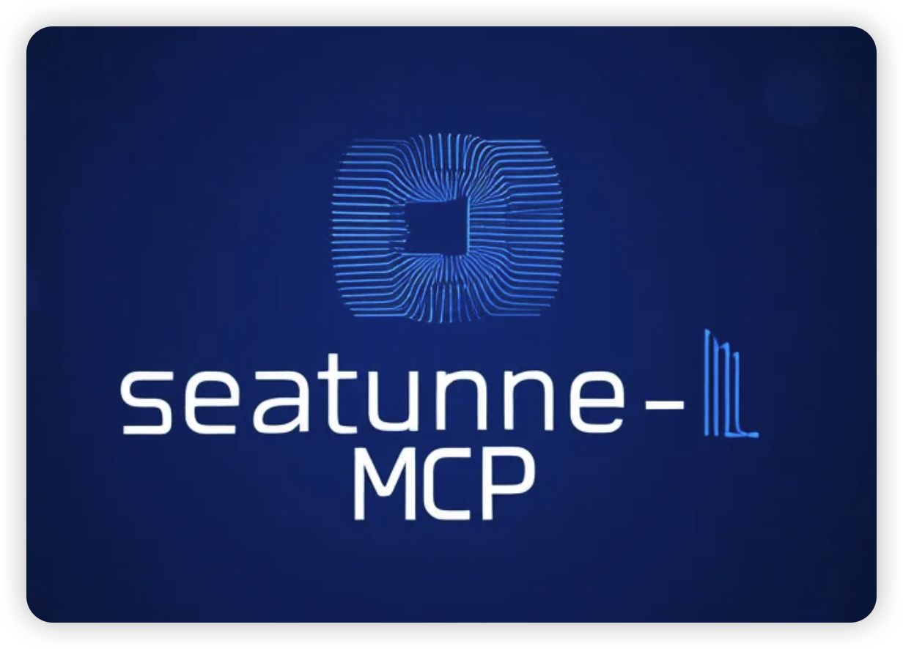
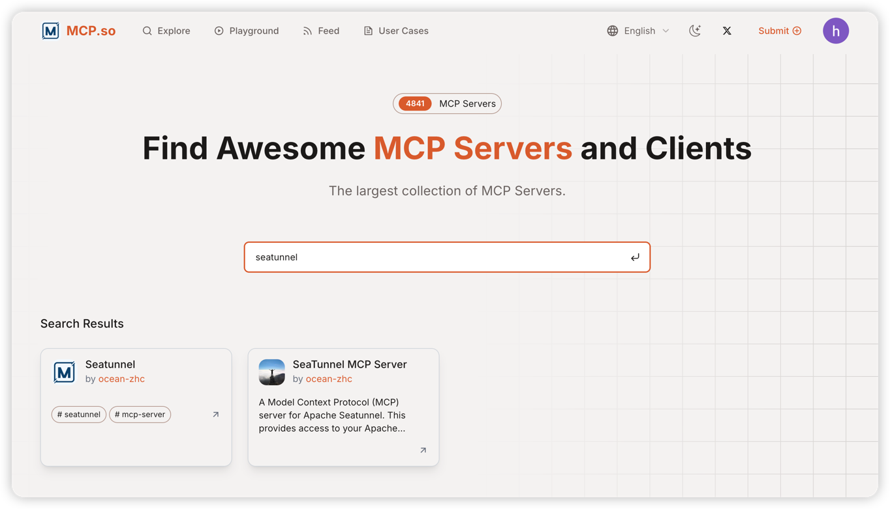

# SeaTunnel MCP Server

A Model Context Protocol (MCP) server for interacting with SeaTunnel through LLM interfaces like Claude.





## Operation Video

To help you better understand the features and usage of SeaTunnel MCP, we provide a video demonstration. Please refer to the link below or directly check the video file in the project documentation directory.

https://www.youtube.com/watch?v=JaLA8EkZD7Q

[](https://www.youtube.com/watch?v=JaLA8EkZD7Q)


> **Tip**: If the video does not play directly, make sure your device supports MP4 format and try opening it with a modern browser or video player. 


## Features

* Job management (submit, stop, monitor)
* System monitoring and information retrieval
* REST API interaction with SeaTunnel services
* Built-in logging and monitoring tools
* Dynamic connection configuration
* Comprehensive job information and statistics

## Installation

```bash
# Clone repository
git clone <repository_url>
cd seatunnel-mcp

# Create virtual environment and install
python -m venv .venv
source .venv/bin/activate  # On Windows: .venv\Scripts\activate
pip install -e .
```

## Requirements

* Python ≥ 3.12
* Running SeaTunnel instance
* Node.js (for testing with MCP Inspector)

## Usage

### Environment Variables

```
SEATUNNEL_API_URL=http://localhost:8090  # Default SeaTunnel REST API URL
SEATUNNEL_API_KEY=your_api_key           # Optional: Default SeaTunnel API key
```

### Dynamic Connection Configuration

The server provides tools to view and update connection settings at runtime:

* `get-connection-settings`: View current connection URL and API key status
* `update-connection-settings`: Update URL and/or API key to connect to a different SeaTunnel instance

Example usage through MCP:

```json
// Get current settings
{
  "name": "get-connection-settings"
}

// Update connection settings
{
  "name": "update-connection-settings",
  "arguments": {
    "url": "http://new-host:8090",
    "api_key": "new-api-key"
  }
}
```

### Job Management

The server provides tools to submit and manage SeaTunnel jobs:

* `submit-job`: Submit a new job with job configuration
* `submit-jobs`: Submit multiple jobs in batch
* `stop-job`: Stop a running job
* `get-job-info`: Get detailed information about a specific job
* `get-running-jobs`: List all currently running jobs
* `get-finished-jobs`: List all finished jobs by state (FINISHED, CANCELED, FAILED, etc.)

### Running the Server

```bash
python -m src.seatunnel_mcp
```

### Usage with Claude Desktop

To use this with Claude Desktop, add the following to your `claude_desktop_config.json`:

```json
{
  "mcpServers": {
    "seatunnel": {
      "command": "python",
      "args": ["-m", "src.seatunnel_mcp"],
      "cwd": "Project root directory"
    }
  }
}
```

### Testing with MCP Inspector

```bash
npx @modelcontextprotocol/inspector python -m src.seatunnel_mcp
```

## Available Tools

### Connection Management

* `get-connection-settings`: View current SeaTunnel connection URL and API key status
* `update-connection-settings`: Update URL and/or API key to connect to a different instance

### Job Management

* `submit-job`: Submit a new job with configuration in HOCON format
* `submit-job/upload`: submit job source upload configuration file
* `submit-jobs`: Submit multiple jobs in batch, directly passing user input as request body
* `stop-job`: Stop a running job with optional savepoint
* `get-job-info`: Get detailed information about a specific job
* `get-running-jobs`: List all currently running jobs
* `get-running-job`: Get details about a specific running job
* `get-finished-jobs`: List all finished jobs by state

### System Monitoring

* `get-overview`: Get an overview of the SeaTunnel cluster
* `get-system-monitoring-information`: Get detailed system monitoring information

## Changelog

### v1.2.0 (2025-06-10)

**New Features in v1.2.0**
- **SSE Support**: Added `st-mcp-sse` for real-time communication with SeaTunnel MCP via Server-Sent Events (SSE). Corresponding sse branch
- **UV/Studio Mode**: Added `st-mcp-uv` (or `st-mcp-studio`) to support running the MCP server using the `uv` tool for improved performance and async support. Corresponding to uv branch

#### Example `claude_desktop_config.json`:

```json
{
  "mcpServers": {
    "st-mcp-sse": {
      "url": "http://your-server:18080/sse"
    },
    "st-mcp-uv": {
      "command": "uv",
      "args": ["run", "seatunnel-mcp"],
      "env": {
        "SEATUNNEL_API_URL": "http://127.0.0.1:8080"
      }
    }
  }
}

```

### v1.1.0 (2025-04-10)

- **New Feature**: Added `submit-jobs` and `submit-job/upload` tool for batch job submission and Document submission operations
  - Allows submitting multiple jobs at once with a single API call
  - Input is passed directly as the request body to the API
  - Supports JSON format for job configurations
  - Allow submission of jobs based on documents

### v1.0.0 (Initial Release)

- Initial release with basic SeaTunnel integration capabilities
- Job management tools (submit, stop, monitor)
- System monitoring tools
- Connection configuration utilities

## License

Apache License 