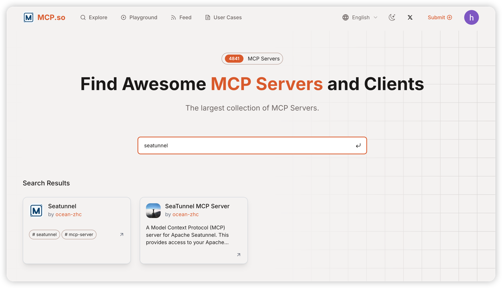

# SeaTunnel MCP 服务器

SeaTunnel MCP（Model Context Protocol）服务器，提供与大型语言模型（如 Claude）交互的能力，使其能够操作 SeaTunnel 任务。




## 操作视频

为了帮助您更好地了解 SeaTunnel MCP 的功能和使用方法，我们提供了一段操作视频演示。请参考以下链接或直接在项目文档目录中查看视频文件。

https://www.bilibili.com/video/BV1UXZgY8EqS

> **提示**：如果视频无法直接播放，请确保您的设备支持 MP4 格式，并尝试使用现代浏览器或视频播放器打开。


## 功能特点

* **作业管理**：提交、停止、监控 SeaTunnel 作业
* **系统监控**：获取集群概览和详细的系统监控信息
* **REST API 交互**：与 SeaTunnel 服务进行无缝交互
* **内置日志和监控工具**：全面的日志和监控功能
* **动态连接配置**：能够在运行时切换不同的 SeaTunnel 实例
* **全面的作业信息**：提供详细的作业运行状态和统计数据

## 安装

```bash
# 克隆仓库
git clone <仓库URL>
cd seatunnel-mcp

# 创建虚拟环境并安装
python -m venv .venv
source .venv/bin/activate  # Windows 系统: .venv\Scripts\activate
pip install -e .

# 或者直接使用提供的脚本
./run.sh  # Linux/Mac
run.bat   # Windows
```

## 系统要求

* Python ≥ 3.12
* 运行中的 SeaTunnel 实例
* Node.js（用于 MCP Inspector 测试）

## 使用方法

### 环境变量配置

```
SEATUNNEL_API_URL=http://localhost:8090  # 默认 SeaTunnel REST API URL
SEATUNNEL_API_KEY=your_api_key           # 可选：默认 SeaTunnel API 密钥
```

### 命令行工具

SeaTunnel MCP 提供了命令行工具，方便启动和配置服务器：

```bash
# 显示帮助信息
seatunnel-mcp --help

# 初始化环境配置文件
seatunnel-mcp init

# 运行 MCP 服务器
seatunnel-mcp run --api-url http://your-seatunnel:8090

# 为 Claude Desktop 配置 MCP 服务器
seatunnel-mcp configure-claude
```

### 动态连接配置

服务器提供了工具来查看和更新运行时的连接设置：

* `get-connection-settings`：查看当前连接 URL 和 API 密钥状态
* `update-connection-settings`：更新 URL 和/或 API 密钥以连接到不同的 SeaTunnel 实例

MCP 使用示例：

```json
// 获取当前设置
{
  "name": "get-connection-settings"
}

// 更新连接设置
{
  "name": "update-connection-settings",
  "arguments": {
    "url": "http://new-host:8090",
    "api_key": "new-api-key"
  }
}
```

### 作业管理

服务器提供工具来提交和管理 SeaTunnel 作业：

* `submit-job`：提交新作业
* `submit-jobs`：批量提交多个作业
* `stop-job`：停止运行中的作业
* `get-job-info`：获取特定作业的详细信息
* `get-running-jobs`：列出所有正在运行的作业
* `get-running-job`：获取特定运行中作业的详情
* `get-finished-jobs`：按状态列出已完成的作业

### 运行服务器

```bash
python -m src.seatunnel_mcp
# 或者使用命令行工具
seatunnel-mcp run
```

### 与 Claude Desktop 集成

要在 Claude Desktop 中使用，请在 `claude_desktop_config.json` 中添加以下内容：

```json
{
  "mcpServers": {
    "seatunnel": {
      "command": "python",
      "args": ["-m", "src.seatunnel_mcp"], 
       "cwd": "Project root directory"
    }
  }
}
```

### 使用 MCP Inspector 测试

```bash
npx @modelcontextprotocol/inspector python -m src.seatunnel_mcp
```

## 可用工具

### 连接管理

* `get-connection-settings`：查看当前 SeaTunnel 连接 URL 和 API 密钥状态
* `update-connection-settings`：更新 URL 和/或 API 密钥以连接到不同实例

### 作业管理

* `submit-job`：提交新作业
* `submit-jobs`：批量提交多个作业，直接将用户输入作为请求体传递
* `submit-job/upload`：提交作业来源上传配置文件
* `stop-job`：停止运行中的作业
* `get-job-info`：获取特定作业的详细信息
* `get-running-jobs`：列出所有正在运行的作业
* `get-running-job`：获取特定运行中作业的详情
* `get-finished-jobs`：按状态列出已完成的作业

### 系统监控

* `get-overview`：获取 SeaTunnel 集群概览
* `get-system-monitoring-information`：获取详细的系统监控信息


## 开发

如果您想为项目贡献代码：

1. 克隆仓库并设置开发环境：
   ```bash
   python -m venv .venv
   source .venv/bin/activate
   pip install -e ".[dev]"
   ```

2. 安装预提交钩子：
   ```bash
   pip install pre-commit
   pre-commit install
   ```

3. 运行测试：
   ```bash
   pytest -xvs tests/
   ```

详细的开发指南请参阅 [开发者指南](docs/DEVELOPER_GUIDE.md)。

## 贡献

1. Fork 仓库
2. 创建功能分支
3. 提交变更
4. 创建 Pull Request

## 更新日志

### v1.2.0 (2025-06-09)
**v1.2.0 新功能**

- **SSE 实时通信**：新增 `st-mcp-sse`，支持通过 Server-Sent Events（SSE）协议与 SeaTunnel MCP 实现实时数据推送。 对应sse分支
- **UV/Studio 模式**：新增 `st-mcp-uv`（或 `st-mcp-studio`），支持通过 `uv` 工具运行 MCP 服务器，提升异步和高性能场景下的运行效率。对应uv分支

#### `claude_desktop_config.json` 配置示例：

```json
{
  "mcpServers": {
    "st-mcp-sse": {
      "url": "http://your-server:18080/sse"
    },
    "st-mcp-uv": {
      "command": "uv",
      "args": ["run", "seatunnel-mcp"],
      "env": {
        "SEATUNNEL_API_URL": "http://127.0.0.1:8080"
      }
    }
  }
}
```

### v1.1.0 (2025-04-10)

- **新功能**：添加了 `submit-jobs` 和`submit-job/upload` 工具用于批量提交作业 和 文件提交作业
  - 允许通过单个 API 调用同时提交多个作业
  - 用户输入直接作为请求体传递给 API
  - 支持 JSON 格式的作业配置
  - 允许根据文件提交作业

### v1.0.0 (初始版本)

- 初始版本，具备基本的 SeaTunnel 集成能力
- 作业管理工具（提交、停止、监控）
- 系统监控工具
- 连接配置实用工具

## 许可证

Apache License 